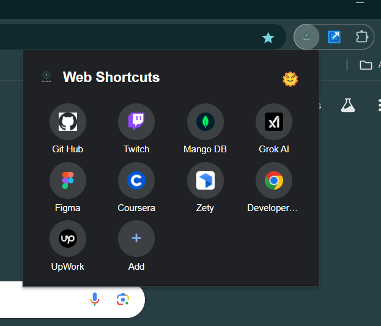

# 🔗 Chrome Shortcut Extension

A simple and visually appealing Chrome extension that allows you to create shortcut buttons for quick access to your favorite websites. The shortcuts appear as circular icons with the website's favicon inside!


## ✨ Features
- 📌 **Quick Access:** Save website links and open them with one click.
- 🎨 **Modern UI:** Beautiful and minimalistic design.
- ⚡ **Dynamic Shortcuts:** Add, edit, and remove shortcuts easily.
- 🖼️ **Website Icons:** Automatically fetches and displays favicons.
- 🔧 **Easy Setup:** Just install and start using!

## 📦 Installation

1. **Clone the repository**  
   ```sh
   git clone https://github.com/Zarifwebme/Shortcut_Extension.git
   cd Shortcut_Extension
   

